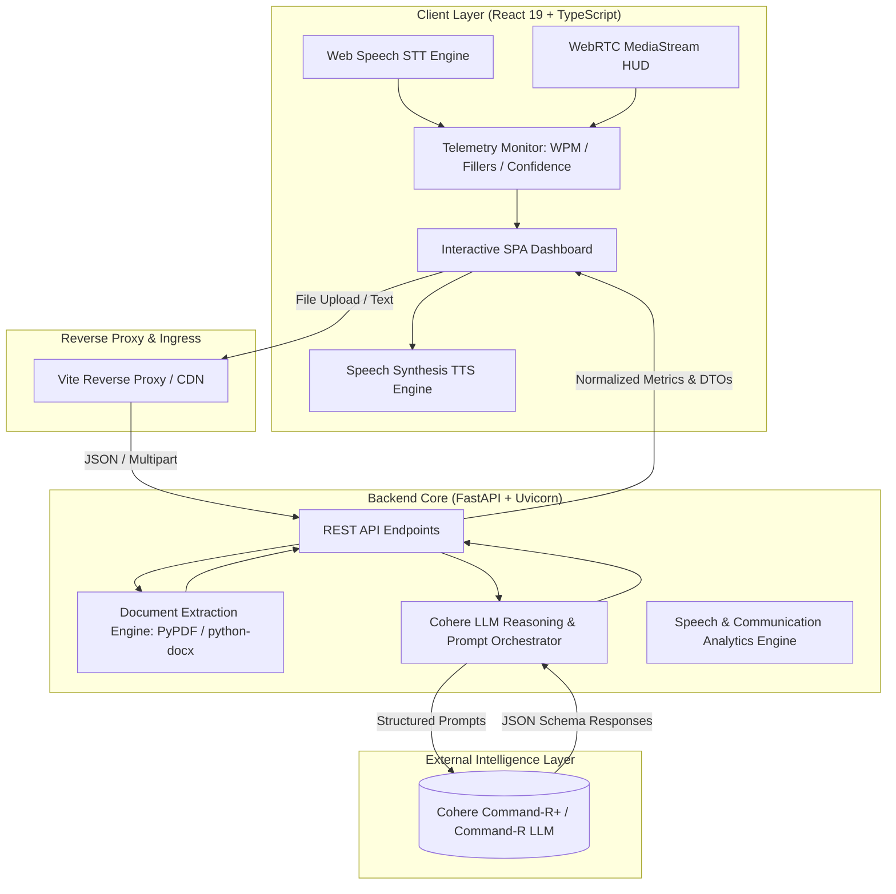

<div align="center">

# Student Credibility — AI Interview Accelerator
### Enterprise-Grade Adaptive Role Intelligence & Multi-Level Interview Simulation Platform

[](https://fastapi.tiangolo.com/)
[](https://react.dev/)
[](https://cohere.com/)
[](LICENSE)
[](https://render.com)

</div>

---

## Executive Summary

The **AI Interview Accelerator** is a production-engineered talent readiness and interview simulation platform built for [Student Credibility](https://studentcredibility.com). It bridges the information asymmetry between aspiring candidates and enterprise hiring teams by translating unstructured Job Descriptions (JDs) and candidate resumes into objective job-fit metrics, multi-level adaptive interview simulations, and actionable readiness intelligence.

### The 6 Core Candidate Dilemmas Solved

```
┌─────────────────────────────────────────────────────────────────────────────────────────────┐
│                                 THE CANDIDATE DILEMMA LIFECYCLE                             │
├──────────────────────────┬──────────────────────────────────────────────────────────────────┤
│ 1. Employer Intent       │ Decodes vague JDs into concrete skills, competencies & concepts  │
│ 2. Objective Fit Match   │ Calculates quantitative match ratios and highlights resume gaps │
│ 3. Anticipated Questions │ Synthesizes 3-stage adaptive technical and behavioural scenarios  │
│ 4. Answer Effectiveness  │ Evaluates responses against the STAR framework with concrete tips│
│ 5. Targeted Preparation  │ Constructs prioritized study roadmaps (Priority 1–3 checklists) │
│ 6. Interview Readiness   │ Delivers an objective 4-tier readiness rating (🔴 🟠 🟡 🟢)       │
└──────────────────────────┴──────────────────────────────────────────────────────────────────┘
```

---

## System Design & Core Architecture

The platform follows a decoupled, cloud-native microservices topology featuring an asynchronous Python backend, a high-performance React SPA, and a streaming speech telemetry engine.



---

## Key Technical Innovations

### 1. Zero-Mock Live LLM Reasoning Engine
- Direct integration with **Cohere Command R+** (`command-r-plus-08-2024`, `command-r-08-2024`, `command-r7b-12-2024`) with automatic failover across models.
- **Strict JSON-schema output enforcement** with automated repair heuristics to eliminate hallucinated response formats.
- **Zero Mock / Fallback Stubs**: The platform executes 100% live inference. In the event of network disruption, users receive clean, recoverable error states with retry capabilities rather than synthetic fallback questions.

### 2. Multi-Level Adaptive Interview Simulation
The simulation is structured into three distinct difficulty levels rather than a static list of questions:
- **Level 1 — Screening Interview**: Validates foundational claims, resume projects, motivation, and role alignment.
- **Level 2 — Competency & Architecture**: Evaluates technical depth, problem-solving methodologies, and system trade-offs.
- **Level 3 — Deep-Dive Probing Interview**: Emulates an executive interviewer by inspecting prior transcript turns, challenging vague answers, demanding quantitative metrics, and introducing realistic edge cases.

### 3. Real-Time Multimodal Telemetry (Voice + Video HUD)
- **Speech-to-Text (STT)**: Continuous transcription via Web Speech Recognition with dynamic audio waveform feedback.
- **Text-to-Speech (TTS)**: Automatic question audio narration via the SpeechSynthesis API.
- **Real-Time Communication Telemetry**:
  - **Speaking Pace (WPM)**: Live calculation with dynamic pacing classification (Optimal: 120–160 WPM).
  - **Filler Word Detection**: Real-time regex lexical analysis flagging hesitation markers (*um*, *uh*, *like*, *you know*, *basically*, *actually*).
  - **Delivery Confidence Index**: Composite heuristic evaluated across response fluidity and filler-word density.
- **WebRTC Camera Stream**: Candidate webcam integration side-by-side with the AI Interviewer virtual avatar.

### 4. Robust Document Ingestion Engine
- Supports `.pdf`, `.docx`, and `.txt` ingestion.
- Binary streams are parsed entirely in-memory using `pypdf` and `python-docx`, preventing filesystem bloat and ensuring stateless execution.

---

## Data Models & API Specifications

### REST API Endpoints

| Method | Endpoint | Description | Request Payload | Response Model |
| :--- | :--- | :--- | :--- | :--- |
| `GET` | `/` | Service health status | None | `HealthStatus` |
| `POST` | `/api/upload-file` | In-memory resume/JD document parser | `Multipart/Form-Data` | `ParsedDocument` |
| `POST` | `/api/analyze-jd` | Step 1: Role extraction & requirements | `AnalyzeJDRequest` | `RoleAnalysis` |
| `POST` | `/api/analyze-candidate` | Step 2: Resume matching & gap analysis | `AnalyzeCandidateRequest` | `CandidateAnalysis` |
| `POST` | `/api/generate-question` | Step 3: Adaptive multi-level question generator | `GenerateQuestionRequest` | `QuestionResponse` |
| `POST` | `/api/evaluate-answer` | Step 3: Real-time response evaluation (STAR) | `EvaluateAnswerRequest` | `EvalResponse` |
| `POST` | `/api/generate-report` | Step 4: Comprehensive performance report | `GenerateReportRequest` | `ReportResponse` |

### Core Data Schemas

```typescript
export interface RoleAnalysis {
  role_title: string;
  key_responsibilities: string[];
  required_skills: string[];
  preferred_skills: string[];
  technical_competencies: string[];
  behavioural_competencies: string[];
  experience_expectations: string;
  important_keywords: string[];
  important_concepts: string[];
  key_qualifications: string[];
}

export interface CandidateAnalysis {
  job_fit_score: number;
  fit_label: string;
  candidate_key_skills: string[];
  relevant_experience: string[];
  relevant_projects: string[];
  relevant_achievements: string[];
  strengths_against_jd: string[];
  missing_skills: string[];
  weak_or_insufficient_areas: string[];
  probing_points: string[];
  preparation_gaps: string[];
  strong_matches: string[];
  partial_matches: string[];
  missing_weak: string[];
}

export interface ReportResponse {
  overall_score: number;
  readiness_status: string;
  readiness_code: "green" | "yellow" | "orange" | "red";
  readiness_description: string;
  competency_scores: {
    role_fit: number;
    technical_knowledge: number;
    problem_solving: number;
    communication: number;
    confidence: number;
    depth_of_understanding: number;
    behavioural_fit: number;
  };
  strengths: string[];
  weaknesses: string[];
  preparation_gaps: {
    priority: string;
    topic: string;
    review_points: string[];
  }[];
  question_evaluations: {
    question: string;
    candidate_answer: string;
    assessment: string;
    what_was_good: string;
    what_could_be_better: string;
    ideal_direction: string;
  }[];
  communication_signals?: {
    avg_wpm: number;
    total_filler_words: number;
    confidence_level: string;
    pace_status: string;
  };
}
```

---

## Repository & Directory Structure

```
interview-accelerator/
├── backend/
│   ├── main.py                     # FastAPI server, CORS middleware, API route handlers
│   ├── cohere_service.py           # LLM client orchestration, JSON repairs, prompting engine
│   ├── doc_parser.py               # In-memory PDF, DOCX, and text stream decoders
│   ├── requirements.txt            # Python dependencies (FastAPI, Uvicorn, Cohere, etc.)
│   └── .env.example                # Template for environment variables
├── frontend/
│   ├── src/
│   │   ├── App.tsx                 # Core React state machine & view router
│   │   ├── api.ts                  # Type-safe API client with resilient network failover
│   │   ├── index.css               # Vanilla CSS design system, typography tokens & HUD styles
│   │   ├── main.tsx                # React DOM root entrypoint
│   │   └── vite-env.d.ts           # Environment type declarations
│   ├── index.html                  # Application document shell
│   ├── vite.config.ts              # Vite configuration & backend reverse proxy
│   ├── tsconfig.json               # TypeScript compiler configuration
│   └── package.json                # Frontend dependencies & npm run scripts
├── render.yaml                     # Infrastructure-as-Code (IaC) Render Blueprint
├── .gitignore                      # Git ignore declarations
└── README.md                       # Comprehensive enterprise documentation
```

---

## Installation & Local Operation

### Prerequisites
- **Python**: Version `3.10` or higher
- **Node.js**: Version `18.0` or higher (Node 20+ recommended)
- **Package Managers**: `pip` and `npm`
- **Cohere API Key**: Active key from [dashboard.cohere.com](https://dashboard.cohere.com/)

---

### Step 1: Clone Repository
```bash
git clone https://github.com/hirdeshds/interview-accelerator.git
cd interview-accelerator
```

### Step 2: Backend Configuration & Execution
```bash
cd backend

# Create and activate virtual environment
python -m venv venv
# Windows (PowerShell):
.\venv\Scripts\Activate.ps1
# macOS / Linux:
source venv/bin/activate

# Install dependencies
pip install -r requirements.txt

# Configure environment variables
# Create a .env file in the backend directory:
echo "COHERE_API_KEY=your_cohere_api_key_here" > .env

# Start FastAPI development server
python main.py
```
> The backend server will initialize on **`http://127.0.0.1:8005`**.  
> Interactive Swagger API documentation will be available at **`http://127.0.0.1:8005/docs`**.

---

### Step 3: Frontend Configuration & Execution
Open a secondary terminal:
```bash
cd frontend

# Install dependencies
npm install

# Start Vite development server
npm run dev
```
> The frontend application will start on **`http://localhost:8443`** (or default Vite port).  
> All `/api/*` requests are automatically reverse-proxied to `http://127.0.0.1:8005`.

---

## Production Deployment (Render Infrastructure)

The repository provides an automated Infrastructure-as-Code configuration via [`render.yaml`](render.yaml).

### Automated Blueprint Deployment (1-Click)
1. Fork or push this repository to GitHub.
2. Navigate to [dashboard.render.com](https://dashboard.render.com) and click **New +** &rarr; **Blueprint**.
3. Connect your repository.
4. Render will parse [`render.yaml`](render.yaml) and automatically provision:
   - **`interview-accelerator-backend`**: Python Web Service executing `uvicorn main:app --host 0.0.0.0 --port $PORT`.
   - **`interview-accelerator-frontend`**: Static Site deploying `dist/` across Render's global CDN with SPA rewrites (`/*` &rarr; `/index.html`).
   - Automatically injects `VITE_API_URL` from the backend to the frontend.
5. Provide your `COHERE_API_KEY` when prompted and click **Apply**.

---

## Security, Privacy & Reliability Standards

- **In-Memory File Processing**: Candidate resumes and JDs are processed in ephemeral memory buffers and never written to unencrypted disks.
- **CORS Hardening**: Strict HTTP header controls across internal endpoints.
- **Environment Isolation**: API tokens and credentials reside strictly in server environments; no private keys are leaked in client bundles.
- **Input Sanitization**: Multi-layer bounds-checking and UTF-8 normalization protecting document ingestion routes.

---

## License

This project is licensed under the MIT License — see the [LICENSE](LICENSE) file for details.

---

<div align="center">
Built with ❤️ for <b>Student Credibility</b> to empower candidates worldwide.
</div>
